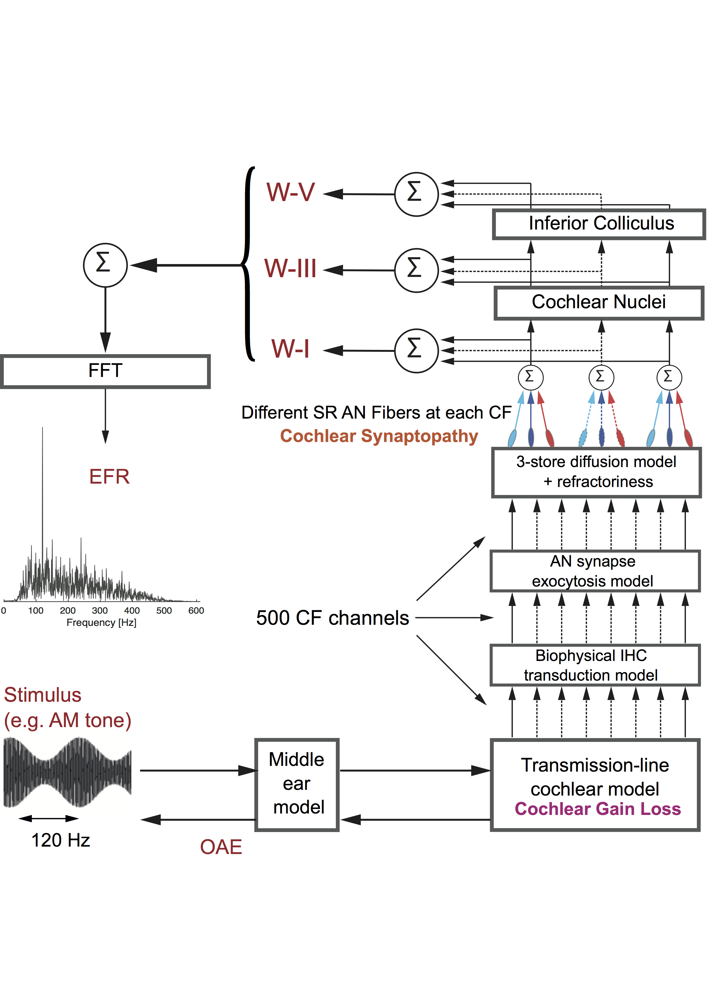

# Verhulstetal2018Model

The model code version 1.2 for the Verhulst, Altoè, Vasilkov 2018 Hearing Research publication:
Computational modeling of the human auditory periphery: Auditory-nerve responses, evoked potentials and hearing loss.
*Hearing Research* 360, 55-75. (found in 'doc/' folder)

A short and an extended version of the v1.2 release note can be found in the 'doc/' folder. The previous version can be found under the v1.1-master git branch.
Version 1.2 includes an update of the Inferior Colliculus stage (IC). A minor change was introduced to the cochlear nucleus stage (CN). As a consequence, the scaling constants M1, M3, and M5 (calibrated using the flag 'abr') were also updated. All other model stages remained unchanged.

This work received funding from the European Research Council (ERC) under the Horizon 2020 Research and Innovation Programme (grant agreement No 678120 RobSpear)

The model code and interface was written by Alessandro Altoè and Sarah Verhulst (copyright 2012,2014,2015,2016,2018) and is licensed under the UGent acadamic license (see details in license file that is part of this repository). The Verhulstetal2018Model consists of the following files: tridiag.so, cochlea_utils.c, build.bat, build.sh, run_model2018.py, model2018.m, cochlear_model2018.py, inner_hair_cell2018.py, auditory_nerve2018.py, ic_cn2018.py, ExampleSimulation.m, ExampleAnalysis.m, ExampleSimulation.py, ExampleAnalysis.py, get_RAM_stims.py, OHC_ind.py, ParallelRAMSimulationsEFR.py, the HI profiles in the Poles folder.
Changes in the IC/CN stages (version 1.2) were introduced by Alejandro Osses Vecchi and Sarah Verhulst.
Python scripts (ExampleSimulation.py, ExampleAnalysis.py, get_RAM_stims.py, OHC_ind.py, ParallelRAMSimulationsEFR.py) were updated by Brent Nissens in November 2025.

#####################
How to run the model
#####################

1. INSTALL NUMPY AND SCIPY (anaconda), check whether you should install 32 or 64 bit!
   The model works on python 2.7 and also on 3.6 (with some future warnings)
   verify with some simple code or the "pyversion" command whether python can
   be called from the MATLAB command line (check the internet for examples)
2. COMPILE THE tridiag.so or tridiag.dll (in case you use Windows) file, i.e. the tridiagonal matrix solver part of the cochlear mechanics

   2.1 for mac/linux:

   open a terminal, go to the model folder and type:
   gcc -shared -fpic -O3 -ffast-math -o tridiag.so cochlea_utils.c
   OR run build.sh script:
   ./build.sh

   2.2 for windows:

   The native GCC compiler from the MinGW project needs to be installed on a Windows machine. It can be downloaded from here: https://sourceforge.net/projects/mingw-w64/ (other choices such as cygwin can also work)
   In the installation window choose the desired compiler version (e.g. the latest one) and the computer architecture (i686 for 32-bit OS or x86_64 for 64-bit OS). Install the compiler.
   After the installation is complete, run the migw-w64.bat file from the installation directory (e.g. C:\Program Files\mingw-w64\x86_64-8.1.0-win32-seh-rt_v6-rev0\).
   Via the terminal go to the model’s folder.
   Run the command:
   gcc --version (to check if gcc was successfully installed)
   gcc -shared -fpic -O3 -ffast-math -o tridiag.dll cochlea_utils.c
   OR run build.bat script
3. Unzip the "Poles" folder
4. RUN THE MATLAB SCRIPT: ExampleSimulation.m
   When you run the model and everything works: "running human auditory model 2018 (version 1.2): Verhulst, Altoe, Vasilkov" printed is in the command window.
   Depending on the number of CPU cores you have, you can usually run 6-10 stimuli at once (i.e., size of the stim vector)
   Keep the stimuli short! 100-200ms stimuli work well. The model does not crash for long stimuli, but it may take very long before it is ready. If you want to run speech, please start with shorter segments first and find your optimal approach. Note that you may have to limit the number of parameters you save to optimize disk space, if you run long simulations.
5. RUN THE MATLAB SCRIPT: ExampleAnalysis.m
6. NOTE TO PYTHON FANS:
   Because all the model code is written in python, it is possible to run the model without MATLAB. MATLAB is only used here to interface with the model: design the stimuli, set the parameters and plot the results.

   The following Python scripts have been updated by Brent Nissens in November 2025 to provide a complete Python-based workflow:

   6.1 RUNNING A SINGLE SIMULATION: ExampleSimulation.py
   This script provides a simple interface to run a single model2018 simulation with a RAM (Rectangular Amplitude Modulation) stimulus.
   It automatically generates the RAM stimulus, loads a poles profile, runs the model, calculates the EFR (Envelope Following Response),
   and displays/saves the results. Usage:
   python ExampleSimulation.py

   The script can be configured with different parameters:
   - carrier_freq: Carrier frequency for RAM stimulus (default: 4000 Hz)
   - poles_profile: Name of poles profile folder in ./Poles/ directory (default: 'Flat00')
   - show_plots: Whether to show plots (default: True)
   - save_results: Whether to save results to MAT files (default: True)

   Note: While the script uses RAM stimuli by default (generated via get_RAM_stims.py), any stimulus the user chooses can be used
   by modifying the script to load or generate custom stimuli.

   6.2 ANALYZING A SIMULATION: ExampleAnalysis.py
   This script provides a simple analysis interface for a single simulation output. It loads the model output and creates
   comprehensive plots showing:
   - Otoacoustic emissions (OAE) in time and frequency domain
   - Basilar membrane velocity (v_bm) and inner hair cell responses (V_IHC)
   - Single unit responses (HSR, MSR, LSR fibers)
   - Population responses (AN, CN, IC)
   - ABR waves (W1, W3, W5) and EFR

   Usage:
   python ExampleAnalysis.py

   The script expects simulation results to be saved in 'Simulations.mat' (or modify the script to point to your output file).

   6.3 GENERATING RAM STIMULI: get_RAM_stims.py
   This script generates RAM (Rectangular Amplitude Modulation) stimuli for use with the model. The RAM stimuli use a 110 Hz
   modulation frequency with a 25% duty cycle square wave modulator. The stimuli are calibrated to match the RMS level of
   a reference SAM tone at 70 dB SPL.

   Function signature:
   stim = get_RAM_stims(fs, fRAM)

   where:
   - fs: Sampling frequency [Hz]
   - fRAM: Array of carrier frequencies [Hz]
   - stim: Matrix of generated stimuli [MxN] where M is the number of frequencies and N is the number of samples

   6.4 CREATING CUSTOM POLES FROM AUDIOGRAMS: OHC_ind.py
   This script creates custom poles profiles based on individual subject audiogram values. It converts hearing loss data
   (frequency-specific hearing thresholds in dB HL) into the poles format required by the model.

   Usage:
   OHC_ind.ohc_ind(name='SubjectName', hl_freqs_hz=[125, 250, 500, ...], hl_db=[0, 5, 10, ...], ...)

   The script outputs:
   - Poles/`<name>`/profile.txt: Audiogram profile visualization
   - Poles/`<name>`/StartingPoles.dat: Poles data file for use with model2018

   This allows users to simulate subjects with custom hearing profiles rather than using only the pre-defined profiles
   in the Poles folder.

   6.5 PARALLEL SIMULATION PIPELINE: ParallelRAMSimulationsEFR.py
   This script provides a complete pipeline for running multiple subject simulations in parallel, calculating EFR values,
   and saving results to CSV. It is particularly useful for batch processing multiple subjects with different audiograms.

   The pipeline:
   1. Loads audiogram data from an Excel file (or can be configured to use custom data)
   2. Converts each subject's audiogram to poles using OHC_ind
   3. Runs simulations in parallel (user can adjust max_workers parameter to control parallelism)
   4. Calculates EFR for each simulation
   5. Saves results to a CSV file with subject names and EFR values

   Usage:
   python ParallelRAMSimulationsEFR.py

   Configuration options in the script:
   - excel_path: Path to Excel file with audiogram data
   - HSR, MSR, LSR: Auditory nerve fiber distributions (can be scalars or frequency-dependent arrays)
   - num_workers: Number of parallel workers (default: all CPU cores, can be adjusted via max_workers parameter)
   - fs: Sampling frequency
   - fRAM: RAM carrier frequencies
   - output_csv: Output CSV filename

   The script uses Python's concurrent.futures for efficient parallel processing and includes progress bars
   for monitoring batch simulations.

   6.6 STIMULUS FLEXIBILITY:
   While the provided Python scripts use RAM stimuli by default (generated via get_RAM_stims.py), users can easily
   modify the scripts to use any stimulus of their choice. Simply replace or modify the stimulus generation/loading
   section in ExampleSimulation.py or ParallelRAMSimulationsEFR.py to use custom stimuli.
7. MAKING MODIFICATIONS BEYOND THE STANDARD PARAMETERS

   7.1 The "Poles" folder has a whole range of auditory profiles (cochlear gain loss) that can be simulated.
   Each folder corresponds to a specific audiogram shape:
   FlatXX refers to a fixed dB HL loss across CF.
   SlopeXX refers to a sloping HF loss starting from 1 kHz and XX corresponds to the loss in dB HL at 8 kHz.
   SlopeXX_Y refers to a sloping HF loss from 1 kHz and a fixed Y dB HL loss for CFs below 1 kHz.
   In each folder, you find the alpha\*,A values that should be loaded into the model (i.e. the StartingPoles.dat file for the considered HL profile). The audiogram shape can be seen by plotting the first and second line of the profile.txt file against eachother. The Poles.mat file has the HI starting poles and corresponding QERBs across the frequencies in fres as well as the the NH reference poles and QERBs.

   7.2 The middle-ear filter parameters can be changed in line 226-227 of cochlear_model2018.py

   7.3 The cochlear compression slope
   can be changed in line 414 of cochlear_model2018.py by changing the 0.31 to another value
   self.PoleE = np.zeros_like(self.x)+0.31 #saturating pole
   note that the "compression_slope=0.4" parameter in line 145 is NOT active (it came from earlier version)

   7.4 The cochlear irregularity percentage (for reflection-source emissions) can be changed in lines 146 and 147 in cochlear_model2018.py by modifying the percentage=0.05 (reflection-source strenght) and kneevar=1 (horizontal random dB shift of vbm,30 compresssion kneepoint)

   7.4 The stimulus level at which the nonlinearity kicks (i.e. the vbm at which compression starts, vbm,30) cannot be changed easily, the vbm thresholds need to be derived from simulations using linear models. It is currently set to a fixed BM vel/disp value corresponding to 30-dB pure-tone response at 1 kHz (see line 415,416).

   7.5 Simulating reflection-source emissions should be done in two simulations:
   a) put the irregularities on (has reflection-source and distortion-source)
   b) put the irregularities off (has distortion-source)
   subtract the emission waveforms.

Happy Modeling!

Sarah and the Hearing Technology group

###########
References
###########

Please cite the 2018 Hearing Research paper and other relevant papers when you use the model (or parts of it) for your research. Additional references with information on model specifics and earlier implementations can be found here:

Altoè A, Pulkki V, Verhulst S. (2018) The effects of the activation of the inner-hair-cell basolateral K+ channels on auditory nerve responses. *Hearing Research* 364: 64-80.
=> Shows how adding the K+ channels in IHC transduction model parameters, has important consequences for the adaptation properties of the auditory nerve.

Altoè A, Pulkki V, Verhulst S. (2017) Model-based estimation of the frequency-tuning of the inner hair cell stereocilia from neural tuning curves. *Journal of the Acoustical Society of America*, 141
=> Explains the IHC transduction model parameters.

Verhulst S, Jagadeesh A, Mauermann M, Ernst F (2016). Individual differences in auditory brainstem response wave
characteristics: Relations to different aspects of peripheral hearing loss. *Trends in Hearing* 20, 2331216516672186.
=> Application of the ABR model for hearing-impairment and synaptopathy (HI pole profiles)

Verhulst S, Bharadwaj H, Mehraei G, Shera CA, Shinn-Cunningham, BG. (2015). Functional modeling of the human auditory brainstem response to broadband stimulation.
*Journal of the Acoustical Society of America* 138 (3): 1637-1659.
=> The CF dependent SheraPoles calibrated to human SFOAE tuning across frequency is described here
=> updated ME filter parameters.
=> note that it is better to use the 2018 model when simulating OAEs given the reactive cochlear Z0 in the 2015 implementation that is now resistive in the 2018 cochlea.

Altoe A, Pulkki V, Verhulst S. (2014). Transmission-line Cochlear Models: Improved Accuracy and Efficiency.
*Journal of the Acoustical Society of America*, 136 EL302.
=> The equation solvers and stability is explained here

Verhulst S, Dau T, Shera CA. (2012). Nonlinear time-domain cochlear model for transient stimulation and human otoacoustic emission.
*Journal of the Acoustical Society of America*, 132 (6), 3842-3848.
=> Explains the cochlear mechanics and moving pole nonlinearity concept

Saremi A, Beutelmann R, Dietz M, Ashida G, Kretzberg J and Verhulst S (2016). A comparative study of seven human cochlear filter models.
*Journal of the Acoustical Society of America*, 140(3), pp.1618-1634.
=> Shows cochlear mechanical responses to different stimuli and different filterbank models

    

